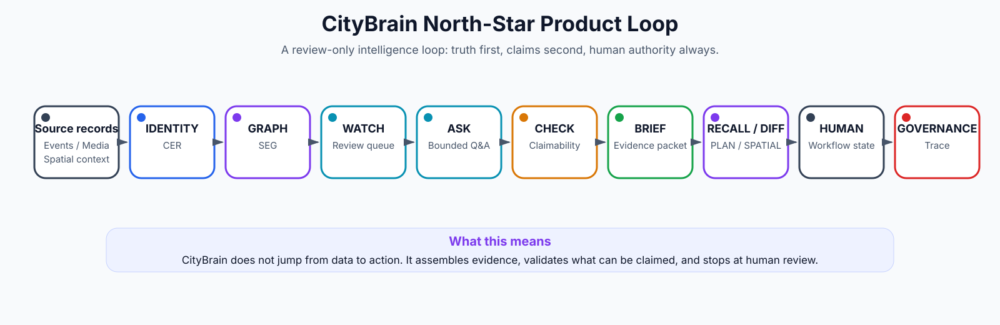

# CityBrain Executive Picture

## The picture in one paragraph

CityBrain is a governed review-only city intelligence cockpit that turns fragmented city records, events, media candidates and spatial context into evidence-backed human-review packets.

It connects source records, events, candidate observations, spatial selections and human workflow into one traceable review loop. The value is not that it "has AI". The value is that it can show what is known, what supports it, what is uncertain, what cannot be claimed, what options are safe to review, and what remains human-only.



## What CityBrain is not

- Not a dashboard.
- Not a chatbot.
- Not a CCTV detector.
- Not a graph demo.
- Not an Omniverse scene.
- Not a production command system.
- Not a legal/enforcement authority.

## What it is

A product layer between messy city reality and eventual approved operations:

```text
source records / events / media / spatial context
-> identity and graph context
-> event fabric / replay / materialized review state
-> ASK / WATCH / CHECK / BRIEF / RECALL / DIFF / PLAN / SPATIAL / SIMULATE
-> operator review surfaces
-> human workflow and governance trace
-> learning/backtesting substrate
-> explicitly authorized experimental learning only
```

## What a product manager can safely say today

"CityBrain can organize city records, candidate observations, spatial context, event traces, review prompts, briefs and option sets into governed evidence packets. It has strong local/replay proofs and one offline experimental forecast. Its current strength is trusted review, not autonomous action."

### Can safely claim
- Ingest and retain city/source records.
- Organize records into evidence-backed entities and context.
- Show source-backed records and review packets.
- Answer bounded ASK-style questions from sealed packets.
- Surface WATCH/review prompts in local/replay contexts.
- Generate briefs and evidence/context packets.
- Support review-only option sets and planning context.
- Connect candidate perception observations to review workflows.
- Show spatial/Omniverse/WebRTC proof paths.
- Run governed traces, ledgers, hash manifests and claim-boundary audits.
- Materialize labels and run one offline experimental forecast under explicit authority.

### Cannot safely claim yet
- Production live operations.
- Public API / SLA.
- Certified citywide digital twin.
- Autonomous monitoring or dispatch.
- Enforcement, legal or certified finding.
- Official ticket/case/work-order creation.
- Product forecast surface.
- Live WATCH consumption of a forecast model.
- Cross-city learned transfer.
- Trained ranking in operator surfaces.
- Production-grade execution adapters.

## The client-ready pitch

CityBrain helps governments and city operators answer: what happened, why does it matter, what evidence supports it, what is uncertain, what should be reviewed next, and what authority is required before anything happens. It is an intelligence-ready city identity and review layer: entity-centric, provenance-backed, confidence-aware, graph-enabled, synthetic-data-driven, department-local first and city-federated next.


_Source basis:_ uploaded Codex/conversation summaries, CityBrain Evolution Digest, CityBrain RTX Vision/Roadmap/Synthetic Data docs, north-star product-loop notes, Metropolis/VSS closeout, Barcelona and task-update files, and the prior consolidation master. This pack is a synthesis layer, not a forensic repo audit.
