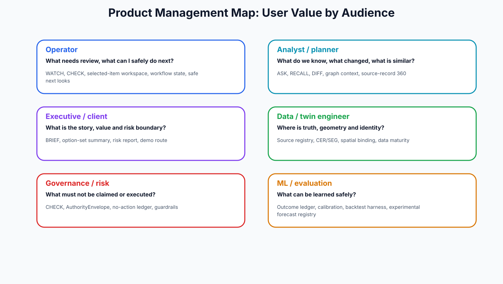

# Product Management Dossier

## Product identity

CityBrain is a governed city intelligence platform for review, evidence, briefing and controlled decision support. Its product unit is not a dashboard widget; it is a packet: entity identity + graph context + evidence + CHECK report + authority envelope + human workflow state.

## User segments and value

| User | Job-to-be-done | CityBrain value |
|---|---|---|
| Operator | What needs review, what can I safely do next? | WATCH, CHECK, selected-item workspace, workflow state, safe next looks |
| Analyst / planner | What do we know, what changed, what is similar? | ASK, RECALL, DIFF, graph context, source-record 360 |
| Executive / client | What is the story, value and risk boundary? | BRIEF, option-set summary, risk report, demo route |
| Data / twin engineer | Where is truth, geometry and identity? | Source registry, CER/SEG, spatial binding, data maturity |
| Governance / risk | What must not be claimed or executed? | CHECK, AuthorityEnvelope, no-action ledger, guardrails |
| ML / evaluation | What can be learned safely? | Outcome ledger, calibration, backtest harness, experimental forecast registry |

## Product modes

### Operator-facing modes

- WATCH: candidate review queue.
- ASK: bounded cited question answering.
- CHECK: evidence sufficiency and claimability validation.
- BRIEF: evidence packet generation.
- RECALL: precedent memory.
- DIFF: change review.
- PLAN: review-only option generation.
- SCHEDULE: review/resource sequencing.
- SPATIAL: map/Omniverse selection and overlay.
- WORKFLOW: local review state and session handling.

### System/reasoning modes

- IDENTITY: entity resolution / canonical registry.
- GRAPH: relationship traversal and dependency reasoning.
- EVENT: event ingestion, state and incident mode.
- PERCEPTION: media to candidate observations.
- SIMULATE: scenario / counterfactual modeling.
- OPTIMIZE: constrained option/schedule generation.
- GOVERN: boundary, refusal and claim audit.

### Platform/commercial modes

- QUALITY/MATURITY: data quality and gap diagnostics.
- FEDERATION: cross-city / cross-department intelligence.
- SYNTHETIC: test/demo/challenge data factory.
- PERSONA: render the same evidence for operator, planner, executive and analyst.

## PM guardrails

1. Do not sell it as live production operations yet.
2. Do not call candidate observations violations or findings.
3. Do not call forecasts product-ready.
4. Do not treat Omniverse as the truth source; packets are truth, pixels are context.
5. Do not let each domain become a bespoke agent. Use domain packs.
6. Treat CHECK v1 and CER engine depth as product dependencies, not technical nice-to-haves.

## Product metrics to start capturing

| Metric | Why it matters |
|---|---|
| Review item completion rate | Is the product useful in real operator sessions? |
| Dismissal / abstain / needs-source rate | Are Watch items relevant and well-supported? |
| Unsupported-claim rate | Is CHECK working? |
| Source-depth score by packet | Can clients trust the evidence? |
| Time-to-brief | Does CityBrain save operator/analyst time? |
| Selected-item confusion count | Is the UI understandable? |
| Evidence export reuse | Are briefs useful outside the cockpit? |
| Human promotion rate | Which packets deserve future workflow integration? |

{source_basis}
