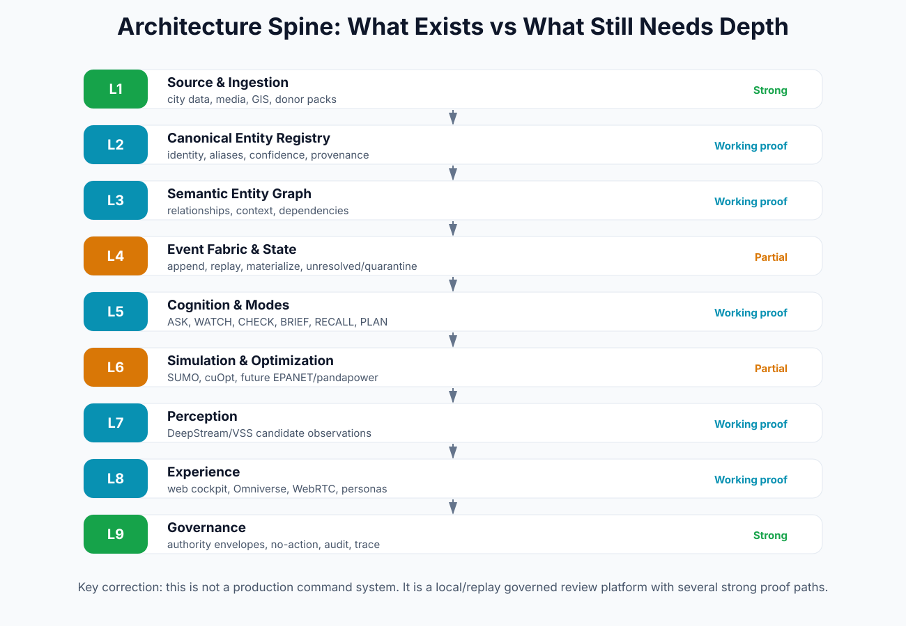

# Architecture Blueprint

## Architecture spine

The hard architectural decision is:

```text
Canonical Entity Registry first
-> Semantic Entity Graph on top
-> Evidence / CHECK / Authority Envelope
-> Review-only intelligence modes
-> Human workflow state
-> Governance trace
```



## Why CER before graph

The core problem is identity under ambiguity: mismatched IDs, inconsistent names, partial geometries, duplicates, stale records and unreliable source keys. The registry must own canonical identity, aliases, source links, confidence, evidence and review state. The graph should project relationships on top of that stable identity layer.

## Nine-layer interpretation

| Layer | Purpose | Current picture |
|---|---|---|
| L1 Source/Ingestion | bring records/media/GIS into the platform | Strong local/replay and data landing proof; production connectors incomplete |
| L2 CER | resolve city entities | contracts strong; engine depth incomplete |
| L3 SEG | express relationships and dependencies | working graph proofs; semantic breadth incomplete |
| L4 Event Fabric | append/replay/materialize/query current state | local/replay proof; production live fabric incomplete |
| L5 Cognition/Modes | ASK/WATCH/CHECK/BRIEF/etc. | several working modes; open router and CHECK v1 incomplete |
| L6 Simulation/Optimization | option and scenario modeling | limited proof; full simulator stack missing |
| L7 Perception | media to candidate observations | DeepStream/VSS proof; candidate-only and not production CCTV |
| L8 Experience | web, Omniverse, WebRTC, personas | strong proof surfaces; product UX and sessions pending |
| L9 Governance | boundaries, trace, authority | strong patterns; execution authority not built |

## Reference architecture


## NVIDIA stack mapping

| Stack area | CityBrain role | Status |
|---|---|---|
| Omniverse / OpenUSD | spatial cockpit, entity/prim binding, future simulation body | functional proof; product scene body partial |
| Cosmos | synthetic data / future world-model rollouts | planned/strategy; not central current proof |
| Metropolis / DeepStream / VSS | candidate perception observations and media review | functional local proof; candidate-only |
| NeMo / NIM | governed evidence-only briefings and LLM seats | proof path exists; LLM authority restricted |
| RAPIDS cuDF/cuSpatial/cuGraph | GPU data/graph acceleration | environment/proofs; production packaging not final |
| cuOpt | review-only optimization / scheduling candidate | one use case; broader schedule mode incomplete |
| Triton/NIM/Docker/NGC | serving/deployment substrate | local proof; production deployment not claimed |

## Critical technical rule

Pixels, model narration and generated text are not truth. The truth object is the evidence packet plus canonical entity ID, source refs, CHECK report, authority envelope and workflow state.


_Source basis:_ uploaded Codex/conversation summaries, CityBrain Evolution Digest, CityBrain RTX Vision/Roadmap/Synthetic Data docs, north-star product-loop notes, Metropolis/VSS closeout, Barcelona and task-update files, and the prior consolidation master. This pack is a synthesis layer, not a forensic repo audit.
