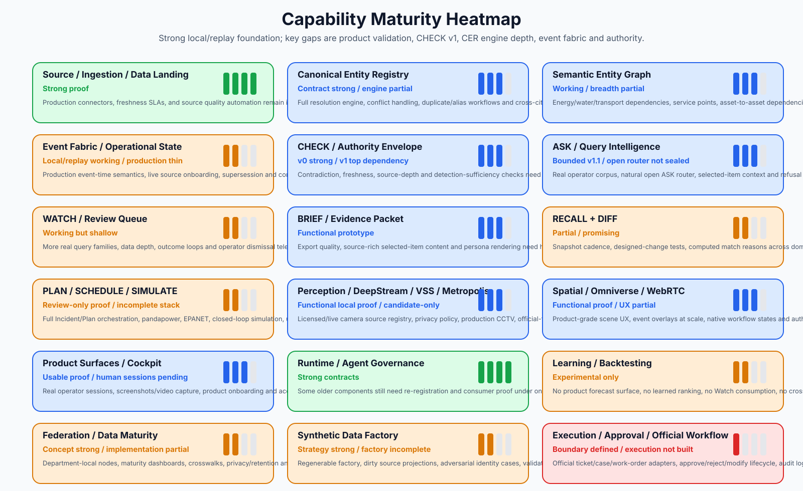

# Capability Maturity Map

## Capability maturity picture

## Maturity matrix

| Capability | Maturity | Built | Gap | Next action |
|---|---|---|---|---|
| Source / Ingestion / Data Landing | Strong proof | NYC, Chicago, London, Barcelona, Helsinki and source landing/consumption packs; output ledger as project memory. | Production connectors, freshness SLAs, and source quality automation remain incomplete. | Normalize ingestion manifests into one SourceRegistry v1. |
| Canonical Entity Registry | Contract strong / engine partial | Entity contracts, ontology v2, provenance/confidence/review-state discipline. | Full resolution engine, conflict handling, duplicate/alias workflows and cross-city identity semantics are not complete. | Build CER Engine R1 with canonical_entities, source_entities, assertions, match_candidates and review queue. |
| Semantic Entity Graph | Working / breadth partial | Canonical graph projections, R7 cross-domain edge substrate, relationship packets. | Energy/water/transport dependencies, service points, asset-to-asset dependencies and temporal edge semantics remain thin. | Graph v2 over CER assertions with edge confidence, review_state and temporal validity. |
| Event Fabric / Operational State | Local/replay working / production thin | R0/R0.1 contracts, local append/replay/materialization, unresolved/quarantine queues. | Production event-time semantics, live source onboarding, supersession and continuous monitoring not complete. | Event Fabric v1: append, replay, resolve, preserve, quarantine, materialize, query, trace. |
| CHECK / Authority Envelope | v0 strong / v1 top dependency | Source-class taxonomy, CheckReports, AuthorityEnvelopes, no-action/no-overclaim gates. | Contradiction, freshness, source-depth and detection-sufficiency checks need product-grade v1. | CHECK v1 with claim-to-evidence mapping and cannot-claim downgrade logic. |
| ASK / Query Intelligence | Bounded v1.1 / open router not sealed | ASK handoff, sealed packet answers, staged router design. | Real operator corpus, natural open ASK router, selected-item context and refusal taxonomy still need validation. | Staged ASK router R1: boundary -> intent family -> target -> answer lens -> selected context. |
| WATCH / Review Queue | Working but shallow | WatchItems, ranked queue items, scout services, family throttles. | More real query families, data depth, outcome loops and operator dismissal telemetry needed. | WATCH v1 family library tied to domain packs and CHECK v1. |
| BRIEF / Evidence Packet | Functional prototype | BRIEF v2 packets, Flow 1 package, executive/operator scripts. | Export quality, source-rich selected-item content and persona rendering need hardening. | BRIEF v3 templates with operator/planner/executive/persona policies. |
| RECALL + DIFF | Partial / promising | Computed matchers, DiffItems, RecallMatchItems, similar-case retrieval. | Snapshot cadence, designed-change tests, computed match reasons across domains and precedent datasets need expansion. | Recall/DIFF R2 on real snapshots with source-level change classifier. |
| PLAN / SCHEDULE / SIMULATE | Review-only proof / incomplete stack | Option sets, inverse dynamics, SUMO context, one cuOpt-style review problem, 9-stage runtime trace. | Full Incident/Plan orchestration, pandapower, EPANET, closed-loop simulation, uncertainty and calibration not complete. | One simulator end-to-end, starting with SUMO then pandapower/EPANET. |
| Perception / DeepStream / VSS / Metropolis | Functional local proof / candidate-only | DeepStream runtime smoke, VSS evidence join, BMD-45 replay, cockpit review integration. | Licensed/live camera source registry, privacy policy, production CCTV, official-finding path not built. | Perception candidate schema + source registry + evidence clip retention policy. |
| Spatial / Omniverse / WebRTC | Functional proof / UX partial | Kit/Composer, OpenUSD binding, WebRTC R5/R6, object/event selection parity. | Product-grade scene UX, event overlays at scale, native workflow states and authoring pipeline still need polish. | Hero-neighbourhood twin with event overlay and evidence card click-through. |
| Product Surfaces / Cockpit | Usable proof / human sessions pending | Web control room, source-record cards, review route, selected-item workspace, demo packs. | Real operator sessions, screenshots/video capture, product onboarding and accessibility not finished. | Epoch 4 review pilot: 5-10 real sessions, task success, confusion logs, export feedback. |
| Runtime / Agent Governance | Strong contracts | ComponentRegistry, AgentRunEnvelope, ToolPermissionPolicy, LLM seats, budgets, replay harness. | Some older components still need re-registration and consumer proof under one runtime contract. | Runtime recertification: no component closes without registered consumer and replay fixture. |
| Learning / Backtesting | Experimental only | Fuel gauge, exposure/outcome ledgers, calibration scaffold, label backfill, one offline forecast. | No product forecast surface, no learned ranking, no Watch consumption, no cross-city learned transfer. | Keep offline until enough operator labels and CHECK calibration exist. |
| Federation / Data Maturity | Concept strong / implementation partial | Federation query v0, data maturity concepts, cross-city cartridges. | Department-local nodes, maturity dashboards, crosswalks, privacy/retention and federation contracts need more depth. | Data Quality & Maturity R1 with identity fragmentation and source coverage dashboards. |
| Synthetic Data Factory | Strategy strong / factory incomplete | Gold/dirty/challenge/scenario strategy, Dubai anchored pack direction, donor-city catalog. | Regenerable factory, dirty source projections, adversarial identity cases, validation harness and replay scenario generation need formalization. | Synthetic Factory v1 around Dubai 217 community polygons if available. |
| Execution / Approval / Official Workflow | Boundary defined / execution not built | No-action policy, HITL approval contract, proposal-only option sets. | Official ticket/case/work-order adapters, approve/reject/modify lifecycle, audit log and monitoring after approval not productionized. | Approval Lifecycle R1 for draft/sandbox only; production execution remains future authority. |

## Read this matrix correctly

Strong does not mean production. In this pack, strong means the local/replay proof chain, artifact discipline and contracts are deep enough to explain and extend. Production live claims remain out of scope until explicit production connectors, security, operator validation and authority policies exist.

{source_basis}
