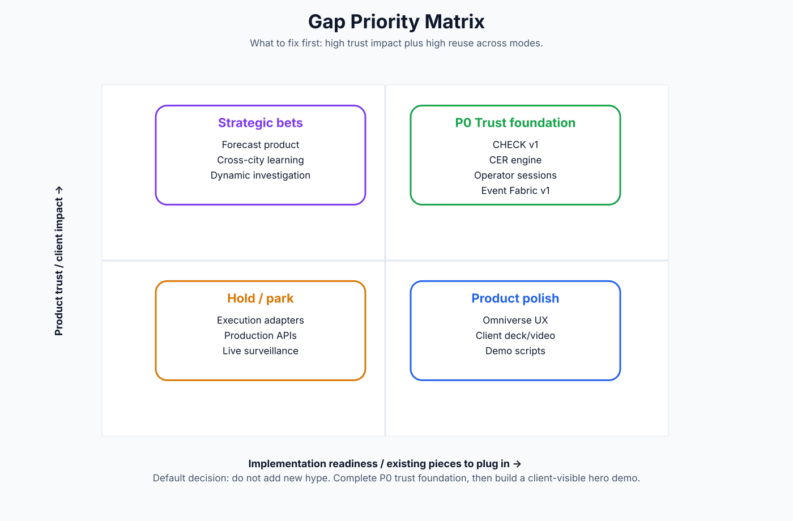

# Gaps, Parked Work and Carry-Forward Risks

## The most important gaps

## Gap / parked work register

| Priority | Gap / parked item | Why it matters | What exists | Where it plugs in | Next action | Owner role |
|---|---|---|---|---|---|---|
| P0 | CHECK v1 contradiction/source-depth/freshness engine | Claimability is the product trust layer; every mode depends on it. | CHECK v0 exists but deeper rules remain open. | Attach to ASK/WATCH/BRIEF/RECALL/DIFF/PLAN/SPATIAL/PERCEPTION. | Build CHECK v1 with claim-to-evidence mapping, stale-source checks, contradiction rules and cannot-claim downgrade. | Governance + product + backend |
| P0 | CER engine depth and conflict resolution | Graph, spatial selection and recall are unsafe if identity is unstable. | Contracts and examples exist; full engine is incomplete. | Use existing source registry, ontology v2, entity assertions, match candidates. | Build CER R1 and bridge all domain packs to canonical IDs. | Data/twin engineer |
| P0 | Real human operator sessions | The product surface is not truly validated without user behavior. | Several gates record human review/session capture pending. | Use D8/D9 demo route, selected-item workspace, BRIEF, WATCH, CHECK. | Run 5-10 recorded review sessions, capture confusion, task success, dismissed WATCH items and export feedback. | Product manager |
| P0 | Event Fabric v1/v2 production depth | Without event fabric the cockpit is mostly static/replay. | Local/replay materialization exists; production live fabric is not done. | Connect perception candidates, source updates, Watch and spatial overlays. | Local v1 first: append/replay/resolve/quarantine/materialize/query/trace; only later live onboarding. | Backend/platform |
| P1 | Execution authority / official workflow adapters | Clients will ask how review becomes action; today it must stay human-only. | HITL and proposal contracts exist, execution adapters are not built. | Approval lifecycle, draft/sandbox ticket packets, AuthorityEnvelope. | Define sandbox adapter only; no production execution until authority policy exists. | Governance + integrations |
| P1 | Open ASK router and real operator corpus | ASK is the natural entry point to the product. | Staged router design exists; training/real operator validation not claimed. | Use selected-item workspace and source-record 360. | Build router eval corpus with refusals, selected-item questions, queue questions and source-profile questions. | Product + ML/eval |
| P1 | Simulation stack beyond one review problem | PLAN/SCHEDULE/SIMULATE needs calibrated models to become more than option copy. | SUMO/cuOpt proof exists; pandapower/EPANET/closed-loop missing. | Use Event Fabric state, graph dependencies, domain packs. | Pick one simulator end-to-end, starting with SUMO, then utilities. | Simulation engineer |
| P1 | Synthetic Data Factory, not just packs | Spark testing and demos need reproducible worlds with known truth and deliberate messiness. | Gold/dirty/challenge/scenario strategy exists; factory not formalized. | Use Dubai community polygons, donor distributions, validation harness. | Generate gold, dirty, challenge and scenario tiers with seeded reproducibility. | Data platform |
| P1 | Data quality / maturity cockpit | This is a strong commercial consulting wedge for departments. | Concepts exist; dashboards underbuilt. | Reuse CER conflicts, source coverage, match candidates, quality scores. | Build maturity scorecards: identity fragmentation, source freshness, relationship coverage. | Product + data |
| P2 | Forecast productization | Offline experiment is promising but not usable by operators yet. | One frozen-replay forecast exists; no product surface or Watch consumption. | Backtest harness, outcome ledger, CHECK calibration. | Keep offline until operator label depth and calibration gates pass. | ML/eval |
| P2 | Cross-city learned transfer / dynamic investigation | Strategic differentiator but unsafe before labels and federation mature. | Explicitly future-track / not armed. | Federation v0, recall, data maturity, case memory. | Hold until Federation R1 and enough reviewed cases exist. | ML + federation |
| P2 | Omniverse product UX and hero-neighbourhood twin | Spatial proof exists; clients need a legible demo body. | WebRTC/Kit proofs exist but UX polish remains separate. | Use object/event overlay parity, asset binding, evidence cards. | Build one hero-neighbourhood twin, not a citywide twin first. | Spatial/twin engineer |
| P2 | Perception source registry and privacy/retention | Media can create risk if treated as truth or stored without policy. | Candidate-only lane exists; live camera/source policy incomplete. | DeepStream/VSS candidate observations, CHECK, Event Fabric. | Define camera registry, retention policy, evidence clips and licensed media boundaries. | Perception + governance |
| P2 | Production security/RBAC/observability | Needed before external stakeholders or real users. | Architecture exists but not production hardening. | Runtime envelopes, audit logs, authority envelopes. | Resume D5 security once product scope is stable. | Platform/security |
| P2 | Documentation source-of-truth drift | The project has many additive outputs; git alone is insufficient. | Evolution digest notes outputs as real lineage and docs as artifacts. | Use this consolidation pack as a publishing layer. | Publish a monthly source-of-truth pack and freeze source crosswalk. | PM / tech writer |

## The non-obvious parked items

### Learning and prediction

Learning is not abandoned; it is deliberately below authority. One offline frozen-replay forecast exists, but it must not appear in product surfaces until operator labels, CHECK calibration, backtests and release criteria are strong.

### Execution and official workflows

The approval boundary is a feature, not a weakness. The next useful step is sandbox/draft workflow objects, not official tickets or dispatch.

### Omniverse

The spatial lane is valuable only when it consumes the same packets as the web cockpit. Event overlays and entity binding matter more than visual polish.

### Data quality

Data maturity is underbuilt relative to its commercial potential. It should become a dashboard and advisory product: identity fragmentation, coverage gaps, source freshness, conflicts, duplicate risk and relationship completeness.

### Synthetic factory

A synthetic pack is not the same as a synthetic factory. The factory must regenerate gold, dirty, challenge and scenario worlds with seeded truth and validation gates.

{source_basis}
