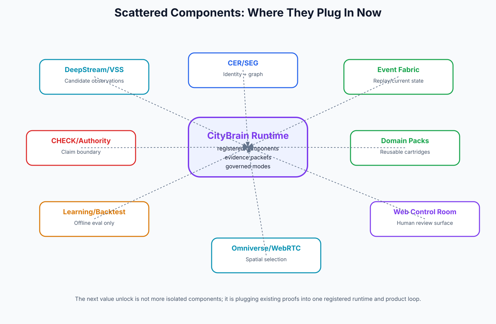

# Component Plug-in Map

## Scattered components and where they add value

## Component plug-in register

| Component | What exists | Where it plugs in | Value unlocked | Main gap | Next action |
|---|---|---|---|---|---|
| Source / Ingestion / Data Landing | NYC, Chicago, London, Barcelona, Helsinki and source landing/consumption packs; output ledger as project memory. | Feeds CER, Event Fabric, Data Quality dashboard, Synthetic Factory. | Normalize ingestion manifests into one SourceRegistry v1. | Production connectors, freshness SLAs, and source quality automation remain incomplete. | Normalize ingestion manifests into one SourceRegistry v1. |
| Canonical Entity Registry | Entity contracts, ontology v2, provenance/confidence/review-state discipline. | Hard spine for graph, ASK, WATCH, BRIEF, spatial selection, federation. | Build CER Engine R1 with canonical_entities, source_entities, assertions, match_candidates and review queue. | Full resolution engine, conflict handling, duplicate/alias workflows and cross-city identity semantics are not complete. | Build CER Engine R1 with canonical_entities, source_entities, assertions, match_candidates and review queue. |
| Semantic Entity Graph | Canonical graph projections, R7 cross-domain edge substrate, relationship packets. | Powers impact reasoning, recall, plan, spatial context and cross-domain cascade. | Graph v2 over CER assertions with edge confidence, review_state and temporal validity. | Energy/water/transport dependencies, service points, asset-to-asset dependencies and temporal edge semantics remain thin. | Graph v2 over CER assertions with edge confidence, review_state and temporal validity. |
| Event Fabric / Operational State | R0/R0.1 contracts, local append/replay/materialization, unresolved/quarantine queues. | Turns WATCH/Incident/Spatial from static context into living review state. | Event Fabric v1: append, replay, resolve, preserve, quarantine, materialize, query, trace. | Production event-time semantics, live source onboarding, supersession and continuous monitoring not complete. | Event Fabric v1: append, replay, resolve, preserve, quarantine, materialize, query, trace. |
| CHECK / Authority Envelope | Source-class taxonomy, CheckReports, AuthorityEnvelopes, no-action/no-overclaim gates. | Attaches to every ASK, WATCH, BRIEF, DIFF, RECALL, PLAN, perception and spatial selection. | CHECK v1 with claim-to-evidence mapping and cannot-claim downgrade logic. | Contradiction, freshness, source-depth and detection-sufficiency checks need product-grade v1. | CHECK v1 with claim-to-evidence mapping and cannot-claim downgrade logic. |
| ASK / Query Intelligence | ASK handoff, sealed packet answers, staged router design. | Gateway into all product modes and client demo Q&A. | Staged ASK router R1: boundary -> intent family -> target -> answer lens -> selected context. | Real operator corpus, natural open ASK router, selected-item context and refusal taxonomy still need validation. | Staged ASK router R1: boundary -> intent family -> target -> answer lens -> selected context. |
| WATCH / Review Queue | WatchItems, ranked queue items, scout services, family throttles. | Main operator worklist; feeds BRIEF, CHECK, RECALL and workflow state. | WATCH v1 family library tied to domain packs and CHECK v1. | More real query families, data depth, outcome loops and operator dismissal telemetry needed. | WATCH v1 family library tied to domain packs and CHECK v1. |
| BRIEF / Evidence Packet | BRIEF v2 packets, Flow 1 package, executive/operator scripts. | Client-ready review packet and executive reporting layer. | BRIEF v3 templates with operator/planner/executive/persona policies. | Export quality, source-rich selected-item content and persona rendering need hardening. | BRIEF v3 templates with operator/planner/executive/persona policies. |
| RECALL + DIFF | Computed matchers, DiffItems, RecallMatchItems, similar-case retrieval. | Gives institutional memory and change detection to operator workspaces. | Recall/DIFF R2 on real snapshots with source-level change classifier. | Snapshot cadence, designed-change tests, computed match reasons across domains and precedent datasets need expansion. | Recall/DIFF R2 on real snapshots with source-level change classifier. |
| PLAN / SCHEDULE / SIMULATE | Option sets, inverse dynamics, SUMO context, one cuOpt-style review problem, 9-stage runtime trace. | Decision support and scenario comparison, never execution by default. | One simulator end-to-end, starting with SUMO then pandapower/EPANET. | Full Incident/Plan orchestration, pandapower, EPANET, closed-loop simulation, uncertainty and calibration not complete. | One simulator end-to-end, starting with SUMO then pandapower/EPANET. |
| Perception / DeepStream / VSS / Metropolis | DeepStream runtime smoke, VSS evidence join, BMD-45 replay, cockpit review integration. | Candidate observations into Event Fabric, CHECK and human review workflow. | Perception candidate schema + source registry + evidence clip retention policy. | Licensed/live camera source registry, privacy policy, production CCTV, official-finding path not built. | Perception candidate schema + source registry + evidence clip retention policy. |
| Spatial / Omniverse / WebRTC | Kit/Composer, OpenUSD binding, WebRTC R5/R6, object/event selection parity. | Turns spatial selection into the same entity/evidence/limitation truth as web cockpit. | Hero-neighbourhood twin with event overlay and evidence card click-through. | Product-grade scene UX, event overlays at scale, native workflow states and authoring pipeline still need polish. | Hero-neighbourhood twin with event overlay and evidence card click-through. |
| Product Surfaces / Cockpit | Web control room, source-record cards, review route, selected-item workspace, demo packs. | This is the human-facing product shell. | Epoch 4 review pilot: 5-10 real sessions, task success, confusion logs, export feedback. | Real operator sessions, screenshots/video capture, product onboarding and accessibility not finished. | Epoch 4 review pilot: 5-10 real sessions, task success, confusion logs, export feedback. |
| Runtime / Agent Governance | ComponentRegistry, AgentRunEnvelope, ToolPermissionPolicy, LLM seats, budgets, replay harness. | Prevents multi-agent drift and makes Codex/Claude-built lanes governable. | Runtime recertification: no component closes without registered consumer and replay fixture. | Some older components still need re-registration and consumer proof under one runtime contract. | Runtime recertification: no component closes without registered consumer and replay fixture. |
| Learning / Backtesting | Fuel gauge, exposure/outcome ledgers, calibration scaffold, label backfill, one offline forecast. | Future prioritization, calibration, case memory and predictive intelligence. | Keep offline until enough operator labels and CHECK calibration exist. | No product forecast surface, no learned ranking, no Watch consumption, no cross-city learned transfer. | Keep offline until enough operator labels and CHECK calibration exist. |
| Federation / Data Maturity | Federation query v0, data maturity concepts, cross-city cartridges. | Commercial consulting/transformation layer for DM/DLD/RTA/DEWA and city-to-city learning. | Data Quality & Maturity R1 with identity fragmentation and source coverage dashboards. | Department-local nodes, maturity dashboards, crosswalks, privacy/retention and federation contracts need more depth. | Data Quality & Maturity R1 with identity fragmentation and source coverage dashboards. |
| Synthetic Data Factory | Gold/dirty/challenge/scenario strategy, Dubai anchored pack direction, donor-city catalog. | Allows demos/testing before departments clean their data. | Synthetic Factory v1 around Dubai 217 community polygons if available. | Regenerable factory, dirty source projections, adversarial identity cases, validation harness and replay scenario generation need formalization. | Synthetic Factory v1 around Dubai 217 community polygons if available. |
| Execution / Approval / Official Workflow | No-action policy, HITL approval contract, proposal-only option sets. | Future Track D authority bridge; currently deliberately blocked. | Approval Lifecycle R1 for draft/sandbox only; production execution remains future authority. | Official ticket/case/work-order adapters, approve/reject/modify lifecycle, audit log and monitoring after approval not productionized. | Approval Lifecycle R1 for draft/sandbox only; production execution remains future authority. |

## The integration principle

Do not create more one-off lanes unless they register into the runtime. Every component should have:

- component ID;
- version;
- owner;
- allowed tools;
- source classes it may read;
- source classes it may write;
- budget/stop policy;
- consumer surfaces;
- replay fixture;
- release/rollback status;
- CHECK/authority behavior.

## Immediate plug-in opportunities

1. **DeepStream/VSS -> Event Fabric -> CHECK -> Review UI**: makes perception useful without making it a fact source.
2. **CER/SEG -> Spatial binding**: makes Omniverse selection trustworthy.
3. **CHECK -> all modes**: converts warnings into a real validation engine.
4. **Outcome ledger -> WATCH**: helps learn which review prompts are useful, before training rankers.
5. **Data maturity -> client story**: turns internal quality work into a sellable diagnostic product.
6. **Domain packs -> flows/cartridges**: prevents bespoke domain agents and protects scale.

{source_basis}
