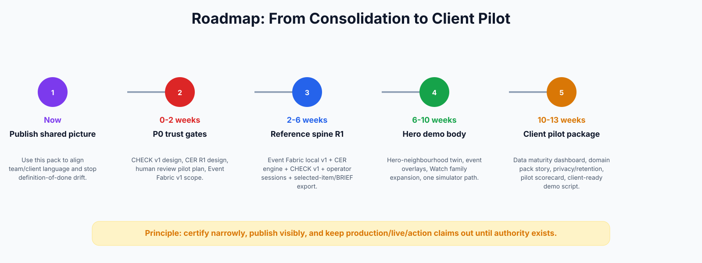

# Roadmap and Next Moves

## Roadmap picture

## Recommended next sequence

| Horizon | Goal | Deliverables |
|---|---|---|
| Now | Publish shared picture | Use this pack to align team/client language and stop definition-of-done drift. |
| 0-2 weeks | P0 trust gates | CHECK v1 design, CER R1 design, human review pilot plan, Event Fabric v1 scope. |
| 2-6 weeks | Reference spine R1 | Event Fabric local v1 + CER engine + CHECK v1 + operator sessions + selected-item/BRIEF export. |
| 6-10 weeks | Hero demo body | Hero-neighbourhood twin, event overlays, Watch family expansion, one simulator path. |
| 10-13 weeks | Client pilot package | Data maturity dashboard, domain pack story, privacy/retention, pilot scorecard, client-ready demo script. |

## P0 execution checklist

1. Publish this consolidation pack as the team/client product room.
2. Build CHECK v1 design and test fixtures.
3. Build CER Engine R1 design and source/entity schema.
4. Run the first real operator review sessions.
5. Finish local Event Fabric v1 as append/replay/resolve/quarantine/materialize/query/trace.
6. Build a hero-neighbourhood spatial demo with event overlays.
7. Freeze the client demo route and record a walkthrough.

## What to avoid next

- Do not start new learning/prediction product surfaces yet.
- Do not sell production live operations.
- Do not over-polish Omniverse before packet truth and event overlays are complete.
- Do not let Dubai, mobility, utilities, compliance or property become separate bespoke brains.
- Do not merge more branches without a visible source-of-truth and register update.

{source_basis}
