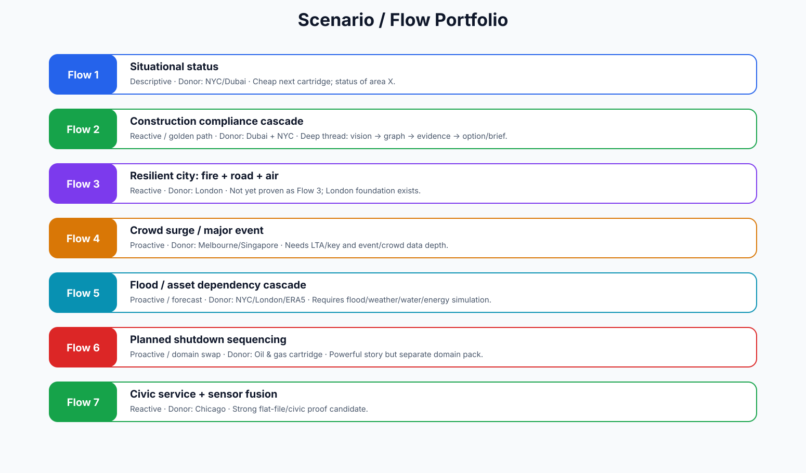

# Client Story and Demo Script

## Client story

CityBrain is how a city moves from fragmented records and isolated dashboards to governed, evidence-backed review intelligence. It does not ask departments to clean everything first. It creates a confidence-aware identity and evidence layer, then helps humans inspect, brief, compare and approve safely.

## Demo story arc

### Scene 1 — The city boots

Show source records, entities, graph context and spatial map/twin as two faces of the same truth.

### Scene 2 — Something deserves review

A WATCH item appears from a source record, event or candidate observation. It is not an alert; it is a review prompt.

### Scene 3 — The operator asks

ASK retrieves only bounded, packet-backed answers. The answer carries source refs and limitations.

### Scene 4 — The system checks itself

CHECK downgrades weak claims, flags proximity-only logic, stale sources, missing evidence and contradictions.

### Scene 5 — The brief is generated

BRIEF turns the packet into a human-readable review note for operator, executive, analyst or planner.

### Scene 6 — Spatial context

Omniverse/WebRTC shows the same entity and event packet. The 3D scene is context; packet truth is the authority.

### Scene 7 — Human decision boundary

The operator can hold, abstain, mark reviewed, request sources or promote to a draft/sandbox workflow. No official action happens.

## The one slide clients need

> CityBrain does not replace city departments or authorize action. It gives them a governed intelligence layer that shows what is known, what is uncertain, what can be claimed, what should be reviewed and what remains human-only.

{source_basis}
